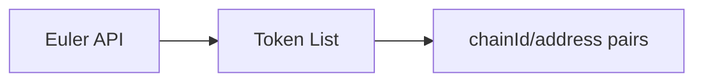
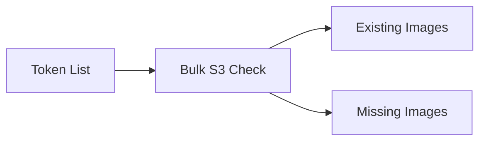
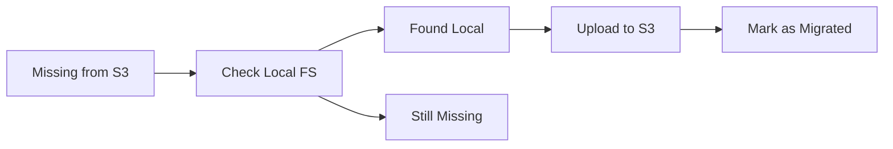
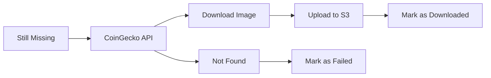
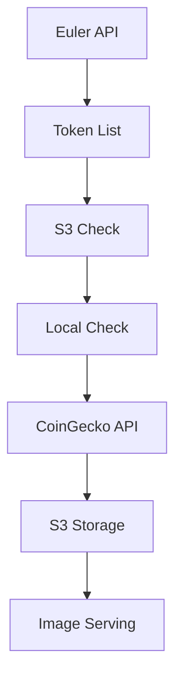

# Euler Token Images

Automated token image fetching and serving for Euler Finance tokens across supported chains.

## Features

- 🔄 **Smart Sync Process**: Automatically migrates local images to S3, then fetches missing images
- 🌐 **S3 Integration**: Stores images in AWS S3 with rich metadata (provider, date, extension)
- 🚀 **HTTP Server**: Fast image serving with fallback to default image
- 📊 **Multiple Providers**: Extensible system supporting CoinGecko + future providers
- 🔍 **Validation**: Zod validation for chainId (number) and address (Ethereum format)
- 📁 **Local Migration**: Automatically uploads existing local images to S3
- 🎯 **Efficient Bulk Operations**: Batch S3 checks and parallel processing
- ⚡ **Rate Limited**: Respects API limits with intelligent batching

## Supported Chains

- **Ethereum** (1)
- **Base** (8453)
- **Sonic** (1923, 146)
- **Bob** (60808)
- **zkSync** (80094)
- **Avalanche** (43114)
- **BSC** (56)
- **Polygon** (130)

## Setup

### Environment Variables

```bash
# Required for CoinGecko API access
COINGECKO_API_KEY=your_coingecko_api_key_here

# Required for Euler Finance API
EULER_API_URL=https://index-dev.euler.finance

# AWS Configuration for S3 storage
AWS_REGION=us-east-1
AWS_ACCESS_KEY_ID=your_aws_access_key
AWS_SECRET_ACCESS_KEY=your_aws_secret_key

# Optional - Server port (default: 4000)
PORT=4000
```

### Local Development

1. Clone the repository
2. Install dependencies: `bun install`
3. Set up environment variables in `.env` file
4. Configure AWS credentials for S3 access
5. Start the server: `bun run start`

### Production Deployment

1. Set environment variables in your deployment platform
2. Ensure AWS S3 bucket `euler-token-images` exists and is accessible
3. Deploy with your preferred method (Docker, serverless, etc.)

## Usage

### Manual Script Execution

```bash
# Install dependencies
bun install

# Set API key (for CoinGecko API)
export COINGECKO_API_KEY=your_api_key_here

# Fetch images from Euler Finance API
bun run fetch-images

# Fetch images from static token lists
bun run fetch-static-images
```

### HTTP Server

Start the image serving server:

```bash
# Start server (default port 4000)
bun run start

# Or specify custom port
PORT=3000 bun run start
```

#### API Endpoints

- `GET /{chainId}/{address}` - Serve token image from S3 or default fallback
- `POST /sync/{chainId}` - Sync token images for a specific chain
- `GET /health` - Health check endpoint

**Image Serving Examples:**
- `GET /1/0xA0b86991c6218b36c1d19D4a2e9Eb0cE3606eB48` → serves USDC image from S3
- `GET /8453/0x833589fcd6edb6e08f4c7c32d4f71b54bda02913` → serves Base USDC image from S3

**Sync Examples:**
- `POST /sync/1` → syncs all Ethereum mainnet tokens
- `POST /sync/8453` → syncs all Base network tokens

## 🔄 Sync Flow

The sync endpoint follows an intelligent 4-step process to efficiently manage token images:

### Step 1: Fetch Token List

- Fetches all tokens for the specified chainId from Euler Finance API
- Validates chainId as a positive integer

### Step 2: Check S3 Bucket

- Efficiently checks S3 bucket `euler-token-images` for existing images
- Uses prefix matching: `{chainId}/{address}/image.*`
- Skips processing for tokens that already have images in S3

### Step 3: Migrate Local Images

- For images missing from S3, checks local filesystem first
- Uploads existing local images to S3 with metadata:
  - `provider: "local-migration"`
  - `downloadDate: ISO timestamp`
  - `extension: file extension`
  - `originalUrl: local file path`

### Step 4: Download Missing Images

- Only after checking S3 and local images, queries external APIs
- Currently supports CoinGecko Pro API
- Extensible provider system for adding more APIs
- Rate limited and batched to respect API limits
- Stores rich metadata in S3

### Sync Response Format

```json
{
  "success": true,
  "data": {
    "chainId": 1,
    "totalTokens": 150,
    "existingImages": 120,      // Already in S3
    "migratedFromLocal": 15,    // Uploaded from local files
    "downloadedImages": 10,     // Downloaded from APIs
    "failedDownloads": 5,       // Failed to find/download
    "duration": 45000,          // Process time in ms
    "details": [
      {
        "address": "0x...",
        "status": "exists|migrated|downloaded|failed",
        "provider": "local-migration|coingecko"
      }
    ]
  }
}
```

### GitHub Actions

The workflow runs daily at midnight UTC or can be triggered manually.

## Storage Architecture

### S3 Bucket Structure

```
euler-token-images/
├── 1/                          # Ethereum mainnet
│   └── 0xa0b86991c6218b36c1d19d4a2e9eb0ce3606eb48/
│       └── image.png           # USDC image with metadata
├── 8453/                       # Base network
│   └── 0x833589fcd6edb6e08f4c7c32d4f71b54bda02913/
│       └── image.jpg           # Base USDC image
└── {chainId}/
    └── {contractAddress}/
        └── image.{extension}   # Auto-detected extension
```

### S3 Object Metadata

Each image stored in S3 includes rich metadata:

```json
{
  "ContentType": "image/png",
  "Metadata": {
    "extension": "png",
    "provider": "coingecko|local-migration",
    "downloadDate": "2025-01-21T10:30:00.000Z",
    "originalUrl": "https://assets.coingecko.com/..." // or local path
  }
}
```

### Local Fallback Structure

For development and migration purposes, local images follow the same pattern:

```
{chainId}/
└── {contractAddress}/
    └── image.{extension}
```

## Scripts

- `start` - Start the HTTP server with sync endpoint and image serving
- `fetch-images` - Legacy: Fetch token images from Euler Finance API + CoinGecko
- `fetch-static-images` - Legacy: Process static token lists and download remote images

> **Recommended**: Use the `POST /sync/{chainId}` endpoint instead of legacy scripts for better efficiency and S3 integration.

## API Sources & Data Flow



- **Token Data**: Euler Finance API (`https://index-dev.euler.finance/v1/tokens`)
- **Image Sources**: 
  1. Local filesystem (migrated automatically)
  2. CoinGecko Pro API (`https://pro-api.coingecko.com/api/v3/coins`)
  3. Extensible provider system for future APIs
- **Storage**: AWS S3 bucket `euler-token-images`
- **Serving**: Direct from S3 with fallback to default image

## Architecture

```
┌─────────────────┐    ┌─────────────────┐    ┌─────────────────┐
│   HTTP Server   │    │  Sync Service   │    │  Image Providers│
│                 │    │                 │    │                 │
│ • Image serving │◄──►│ • S3 operations │◄──►│ • CoinGecko     │
│ • Sync endpoint │    │ • Local migration│    │ • Extensible    │
│ • Validation    │    │ • Batch processing│   │ • Rate limited  │
└─────────────────┘    └─────────────────┘    └─────────────────┘
         │                       │                       │
         ▼                       ▼                       ▼
┌─────────────────┐    ┌─────────────────┐    ┌─────────────────┐
│   AWS S3        │    │ Local Filesystem│    │  Euler Finance  │
│                 │    │                 │    │      API        │
│ • Image storage │    │ • Legacy images │    │                 │
│ • Rich metadata │    │ • Auto migration│    │ • Token lists   │
│ • Global CDN    │    │ • Backup/dev    │    │ • Chain data    │
└─────────────────┘    └─────────────────┘    └─────────────────┘
```