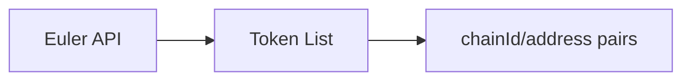
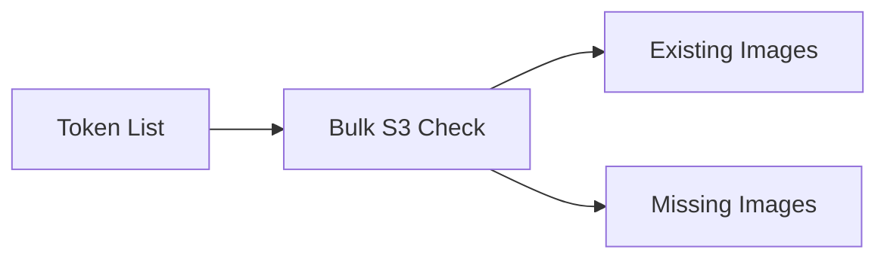
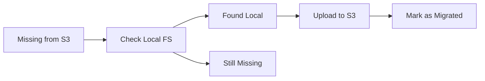
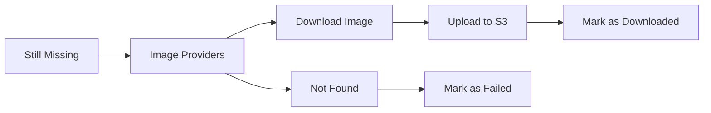
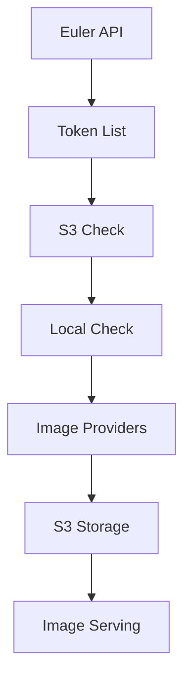

# Euler Token Images

Automated token image fetching and serving for Euler Finance tokens across supported chains.

## Features

- 🔄 **Smart Sync Process**: Automatically migrates local images to S3, then fetches missing images
- 🌐 **S3 Integration**: Stores images in AWS S3 with rich metadata (provider, date, extension)
- 🚀 **HTTP Server**: Fast image serving with fallback to default image
- 📊 **Multiple Providers**: CoinGecko, 1inch, Alchemy, Sim Dune, Pendle, Token Lists
- 🔗 **Pendle PT Support**: Automatically fetches yield token images for PT tokens with teal ring effect
- 🔍 **Validation**: Zod validation for chainId (number) and address (Ethereum format)
- 📁 **Local Migration**: Automatically uploads existing local images to S3
- 🎯 **Efficient Bulk Operations**: Batch S3 checks and parallel processing
- ⚡ **Rate Limited**: Respects API limits with intelligent batching

## Supported Chains

- **Ethereum** (1)
- **Base** (8453)
- **Sonic** (146, 1923)
- **Bob** (60808)
- **Berachain** (80094)
- **Avalanche** (43114)
- **BSC** (56)
- **Unichain** (130)
- **Arbitrum** (42161)

## Setup

### Environment Variables

```bash
# Required for CoinGecko API access
COINGECKO_API_KEY=your_coingecko_api_key_here

# Required for Euler Finance API
EULER_API_URL=https://index-dev.euler.finance

# AWS Configuration for S3 storage
AWS_REGION=us-east-1
EULER_AWS_ACCESS_KEY=your_aws_access_key
EULER_AWS_SECRET_ACCESS_KEY=your_aws_secret_key

# RPC URLs for Pendle PT underlying token resolution
RPC_HTTP_1=https://eth-mainnet.example.com
RPC_HTTP_42161=https://arb-mainnet.example.com
# Add RPC_HTTP_{chainId} for each chain that has PT tokens

# Optional - Server port (default: 4000)
PORT=4000
```

### Local Development

1. Clone the repository
2. Install dependencies: `bun install`
3. Set up environment variables in `.env` file
4. Configure AWS credentials for S3 access
5. Start the server: `bun run start`

### Production Deployment

1. Set environment variables in your deployment platform
2. Ensure AWS S3 bucket `euler-token-images` exists and is accessible
3. Deploy with your preferred method (Docker, serverless, etc.)

## Usage

### HTTP Server

Start the image serving server:

```bash
# Start server (default port 4000)
bun run start

# Or specify custom port
PORT=3000 bun run start
```

#### API Endpoints

- `GET /{chainId}/{address}` - Serve token image from S3 or default fallback
- `GET /sync/{chainId}` - Trigger sync or get running status for a specific chain
- `GET /sync/{chainId}/status` - Get sync status only (doesn't trigger new sync)
- `GET /health` - Health check endpoint

**Image Serving Examples:**
- `GET /1/0xA0b86991c6218b36c1d19D4a2e9Eb0cE3606eB48` → serves USDC image from S3
- `GET /8453/0x833589fcd6edb6e08f4c7c32d4f71b54bda02913` → serves Base USDC image from S3

**Sync Examples:**
- `GET /sync/1` → syncs all Ethereum mainnet tokens
- `GET /sync/8453` → syncs all Base network tokens

## 🔄 Sync Flow

The sync endpoint follows an intelligent 4-step process to efficiently manage token images:

### Step 1: Fetch Token List

```mermaid
graph LR
    A[Euler API] --> B[Token List]
    B --> C[chainId/address pairs]
```
- Fetches all tokens for the specified chainId from Euler Finance API
- Validates chainId as a positive integer

### Step 2: Check S3 Bucket

```mermaid
graph LR
    A[Token List] --> B[Bulk S3 Check]
    B --> C[Existing Images]
    B --> D[Missing Images]
```
- Efficiently checks S3 bucket `euler-token-images` for existing images
- Uses exact key: `{chainId}/{address}/image` (extension stored in metadata)
- Skips processing for tokens that already have images in S3

### Step 3: Migrate Local Images

```mermaid
graph LR
    A[Missing from S3] --> B[Check Local FS]
    B --> C[Found Local] --> D[Upload to S3]
    B --> E[Still Missing]
    D --> F[Mark as Migrated]
```
- For images missing from S3, checks local filesystem first
- Uploads existing local images to S3 with metadata:
  - `provider: "local-migration"`
  - `downloadDate: ISO timestamp`
  - `extension: file extension`
  - `originalUrl: local file path`

### Step 4: Download Missing Images

```mermaid
graph LR
    A[Still Missing] --> B[Image Providers]
    B --> C[Download Image]
    C --> D[Upload to S3]
    D --> E[Mark as Downloaded]
    B --> F[Not Found] --> G[Mark as Failed]
```
- Only after checking S3 and local images, queries external APIs
- Provider priority: Local → **PT Underlying** → CoinGecko → 1inch → Alchemy → Sim Dune → Pendle → Token Lists
- For PT tokens (with `isPendlePT: true`), fetches the underlying yield token's image automatically
- All providers queried in parallel; first successful result (by priority) wins
- Rate limited to respect API limits
- Stores rich metadata in S3

### Sync Response Format

```json
{
  "success": true,
  "data": {
    "chainId": 1,
    "totalTokens": 150,
    "existingImages": 120,      // Already in S3
    "migratedFromLocal": 15,    // Uploaded from local files
    "downloadedImages": 10,     // Downloaded from APIs
    "failedDownloads": 5,       // Failed to find/download
    "duration": 45000,          // Process time in ms
    "details": [
      {
        "address": "0x...",
        "status": "exists|migrated|downloaded|failed",
        "provider": "local-migration|coingecko|1inch|alchemy|..."
      }
    ]
  }
}
```

### GitHub Actions

The workflow runs daily at midnight UTC or can be triggered manually.

## Storage Architecture

### S3 Bucket Structure

```
euler-token-images/
├── 1/                          # Ethereum mainnet
│   └── 0xa0b86991c6218b36c1d19d4a2e9eb0ce3606eb48/
│       └── image               # USDC image (extension in metadata)
├── 8453/                       # Base network
│   └── 0x833589fcd6edb6e08f4c7c32d4f71b54bda02913/
│       └── image               # Base USDC image
└── {chainId}/
    └── {contractAddress}/
        └── image               # Extension stored in S3 metadata
```

### S3 Object Metadata

Each image stored in S3 includes rich metadata:

```json
{
  "ContentType": "image/png",
  "Metadata": {
    "extension": "png",
    "provider": "coingecko|1inch|alchemy|local-migration|...",
    "downloadDate": "2025-01-21T10:30:00.000Z",
    "originalUrl": "https://assets.coingecko.com/..." // or local path
  }
}
```

### Local Fallback Structure

For development and migration purposes, local images follow the same pattern:

```
{chainId}/
└── {contractAddress}/
    └── image.{extension}
```

## Pendle PT Token Handling

For tokens marked with `isPendlePT: true` in the tokenlist (`.data/*.json`), the system automatically:

### 1. Fetches Underlying Yield Token Image

The `PendlePTUnderlyingProvider` resolves the yield token address on-chain:
1. Calls `SY()` on the PT contract to get the SY (Standardized Yield) address
2. Calls `yieldToken()` on the SY contract to get the yield token address
3. Fetches the yield token's image from other providers (CoinGecko, 1inch, etc.)

This requires RPC URLs configured via `RPC_HTTP_{chainId}` environment variables.

### 2. Applies Teal Ring Effect

When serving the image, a teal ring (#17e3c2) is automatically applied to visually distinguish PT tokens. This happens for:

1. Any token marked as `isPendlePT: true` in the tokenlist, OR
2. Token addresses in the exceptions list

**For PTs not in tokenlist**, add the address to `PENDLE_PT_EXCEPTIONS` in `src/services/pendle-pt-service.ts`:

```typescript
const PENDLE_PT_EXCEPTIONS = new Set([
    "0xb6168f597cd37a232cb7cb94cd1786be20ead156", // cross-chain pt-cusd
    // Add new PT addresses here (lowercase)
]);
```

### Example Flow

For PT token `0x53F3373F0D811902405f91eB0d5cc3957887220D` (PT-jrUSDe):
1. Provider detects `isPendlePT: true` in tokenlist
2. Calls `SY()` → gets SY contract address
3. Calls `yieldToken()` → gets `0xC58D044404d8B14e953C115E67823784dEA53d8F` (jrUSDe)
4. Fetches jrUSDe image from providers
5. When served, applies teal PT ring to the image

## Scripts

- `start` - Start the HTTP server with sync endpoint and image serving
- `migration` - Run migration script

## API Sources & Data Flow


```mermaid
graph TD
    A[Euler API] --> B[Token List]
    B --> C[S3 Check]
    C --> D[Local Check]
    D --> E[Image Providers]
    E --> F[S3 Storage]
    F --> G[Image Serving]
```

- **Token Data**: Euler Finance API (`https://index-dev.euler.finance/v1/tokens`)
- **Image Sources** (in priority order):
  1. Local filesystem (migrated automatically)
  2. Pendle PT Underlying (fetches yield token image for PT tokens)
  3. CoinGecko Pro API
  4. 1inch Token List
  5. Alchemy API
  6. Sim Dune API
  7. Pendle API
  8. Various Token Lists
- **Storage**: AWS S3 bucket `euler-token-images`
- **Serving**: Direct from S3 with fallback to default image

## Architecture

```
┌─────────────────┐    ┌─────────────────┐    ┌─────────────────┐
│   HTTP Server   │    │  Sync Service   │    │  Image Providers│
│                 │    │                 │    │                 │
│ • Image serving │◄──►│ • S3 operations │◄──►│ • CoinGecko     │
│ • Sync endpoint │    │ • Local migration│   │ • 1inch         │
│ • Validation    │    │ • Batch processing│  │ • Alchemy       │
│                 │    │                 │    │ • Pendle + more │
└─────────────────┘    └─────────────────┘    └─────────────────┘
         │                       │                       │
         ▼                       ▼                       ▼
┌─────────────────┐    ┌─────────────────┐    ┌─────────────────┐
│   AWS S3        │    │ Local Filesystem│    │  Euler Finance  │
│                 │    │                 │    │      API        │
│ • Image storage │    │ • Legacy images │    │                 │
│ • Rich metadata │    │ • Auto migration│    │ • Token lists   │
│ • Global CDN    │    │ • Backup/dev    │    │ • Chain data    │
└─────────────────┘    └─────────────────┘    └─────────────────┘
```